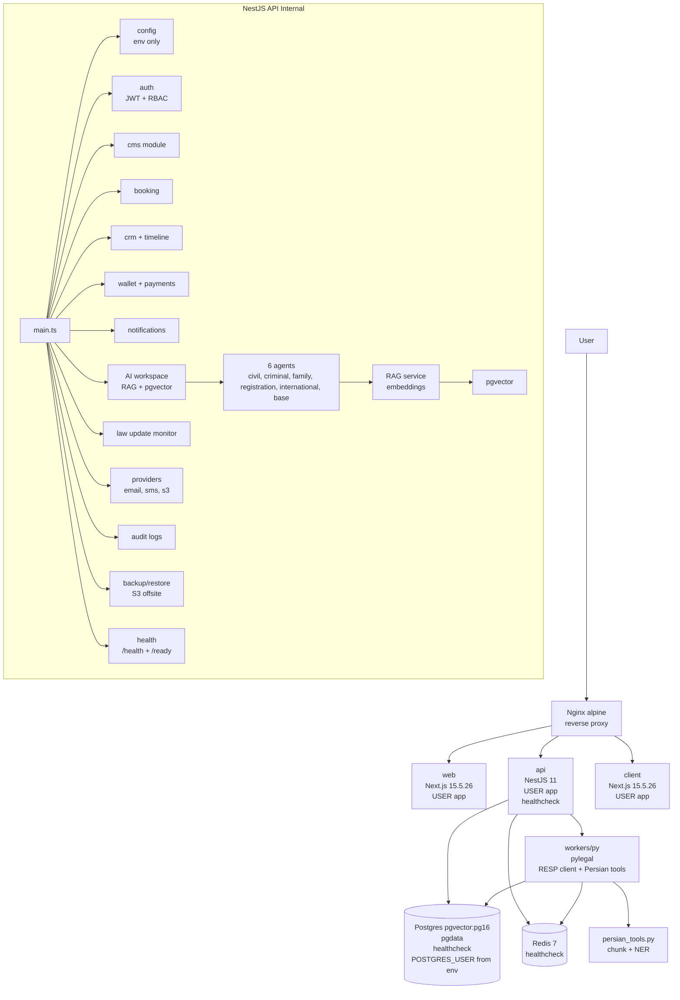

# ARCHITECTURE.md — legal-platform — Self-Hosted Legal Practice OS

## ۳. legal-platform — Self-Hosted Legal Practice OS

### Purpose
Single-tenant self-hosted legal platform: CMS, booking, CRM timeline, wallet, payments, notifications, AI workspace RAG + 6 specialized agents, law update monitor, S3 backup, audit logs, Persian UI.

### Graph

### Connections
- **Nginx → Web/API/Client:** Depends_on service_healthy, reverse proxy
- **API → Postgres:** DATABASE_URL=${DATABASE_URL} from env_file, pgvector for RAG
- **API → Redis:** REDIS_URL from env, for workers queue
- **API → Workers:** Via Redis BLPOP/LPUSH, RESP client minimal stdlib sockets
- **AI → Agents:** 6 specialized agents routed via skillId, RAG via pgvector
- **Workers → Persian Tools:** chunk_legal_text, NER for Iranian names, city detection
- **Backup → S3:** Offsite backup to S3

### Modern Standards Check
- ✅ **Modular Monolith:** apps/api, apps/web, apps/client, apps/agents/*, packages/domain/contracts/shared — DDD
- ✅ **Hexagonal:** providers/* (email, sms, s3) are ports, adapters via env
- ✅ **Security:** JWT, RBAC, audit logs, non-root USER app, no hardcoded secrets, secret scan, RLS? Single-tenant but self-hosted
- ✅ **AI Architecture:** RAG + pgvector + 6 agents with routing, skill-based
- ✅ **Observability:** Health, monitoring, diagnostics, backup/restore
- ✅ **Docker:** Multi-stage, USER app, healthcheck, env_file, depends_on healthy
- ✅ **Testing:** 476 tests (best), unit+integration+e2e
- ✅ **0 Vuln:** After upgrade next 14.2.35→15.5.26, nestjs 10→11, postcss 8.4.31→8.5.28, now 0 vuln
- ✅ **0 Any:** After fix civil/criminal agents + test file
- ✅ **Ruff 0:** After fixing RESP undefined, SIM102, C414, BLE001, UP031
- ⚠️ **Product Gap:** Needs mobile app, e-signature for 10/10 product

### Deep Issues Fixed
- **Hardcoded Password:** POSTGRES_PASSWORD:-legal_password_change_me → require from env
- **Console.log:** 4 → Logger
- **Any 15 → 0:** Proper Record types
- **NPM Audit 13 → 0:** Major upgrade
- **Ruff 72 → 0:** Import sorted, RESP fixed, etc.
- **Package Manager Conflict:** pnpm-lock.yaml + package-lock.json → only package-lock.json
- **ESLint Conflict:** eslint.config.mjs + .eslintrc.json → only .eslintrc.json

---

