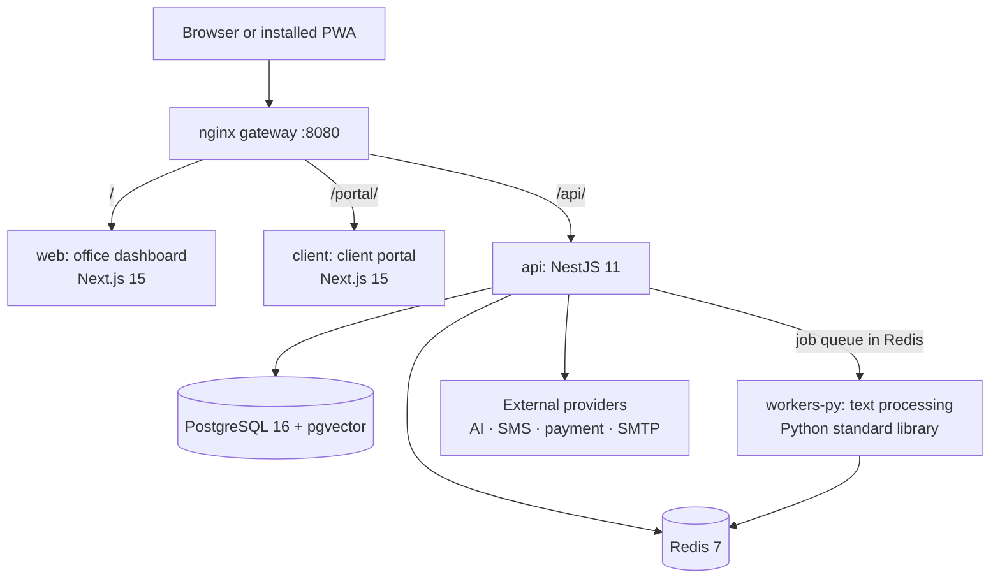

# Architecture

Legal Platform is a single-office, self-hosted system built as a modular monolith. One installation serves one law office: its lawyers and staff through the dashboard, and its clients through the portal.

## Runtime view

| Service | Role |
|---|---|
| `proxy` | nginx; the only published port. Routes `/` to the dashboard, `/portal/` to the portal and `/api/` to the API. Server-sent events are proxied without buffering. |
| `web` | Office dashboard. Talks to the API through relative `/api` URLs. |
| `client` | Client portal, built with `basePath: '/portal'`, installable as a PWA. |
| `api` | All business logic, authentication, scheduling and provider access. |
| `workers-py` | Text extraction (PDF, DOCX), Persian normalisation, chunking and citation extraction. Receives jobs through a Redis list. |
| `postgres` | Identity, sessions, audit log, provider configuration, wallet ledger, vector index and the runtime key-value store. |
| `redis` | Python job queue, optional shared rate limiting and event bridge. |

The production compose file adds an optional `monitoring` profile (Prometheus and Grafana, bound to `127.0.0.1`).

## API modules

| Area | Modules |
|---|---|
| Identity and access | `auth` (SMS and email OTP, passkeys, sessions), `authvault` (area passwords, credential rotation), `machine-tokens`, `audit` |
| Legal work | `orchestrator` (lead assistant, routing to expert assistants, files, voice), `corpus` (legal library and verification), `rag` (retrieval, drafts, usage), `signature` |
| Consultations and money | `billing` (wallet, catalog, purchases, client API), `consultation` (queue and lawyer controls), `notifications` (in-app, SMS panels) |
| Operations | `health`, `ops` (backup bundles, deployment profile), `security` (daily checks and reports), `setup` (wizard), `providers` (provider configuration) |

Every response error uses one format, `{ "success": false, "error": { "code", "message" } }`. Codes and their HTTP statuses are defined once in `packages/contracts`.

## Expert assistants

Questions reach a lead assistant, which classifies the request deterministically first and consults the AI model only when the classification is uncertain. The request is then handed to one of the expert assistants in `apps/agents/*`: civil, criminal, family, registration, international or general. Assistants never call an AI SDK directly; they use the AI provider through the API, and every legal claim must cite a verified library source. A lawyer reviews drafts before they are approved.

## Data

- **Relational tables:** users, roles, sessions, OTP challenges, audit log, provider configuration, the double-entry wallet ledger (`wallet_accounts`, `wallet_entries`) and the vector index (`rag_chunks`).
- **Runtime store:** the legal library, purchases, queue tickets, notifications, drafts, usage records, settings and reports are JSON documents behind `StorageProvider`. With `STORAGE_DRIVER=pg` (the production default when a database is configured) they live in the `runtime_state` table; with `local` they are files under `LOCAL_STORAGE_PATH`.
- **Uploads:** files uploaded by users are stored under `LOCAL_STORAGE_PATH` on the `uploads` volume.

Migrations and their status are listed in [apps/api/src/database/MIGRATIONS.md](apps/api/src/database/MIGRATIONS.md).

## Providers

External services sit behind interfaces in `apps/api/src/providers`: AI (OpenAI-compatible), SMS (Kavenegar, Ghasedak), payment (Zarinpal), email (SMTP), storage, telephony and push. The provider factory selects an adapter from the environment. In production, a category left as `mock` receives an adapter that reports "not configured", so the feature is disabled instead of faking success.

## Security

Short-lived access tokens with rotating refresh tokens and reuse detection, role-based guards, optional passwords per sensitive area, encryption of stored secrets with `ENCRYPTION_MASTER_KEY`, rate limiting, security headers and non-root containers. See [SECURITY.md](SECURITY.md) and [docs/SECURITY-HARDENING.md](docs/SECURITY-HARDENING.md).

## Repository layout

| Path | Contents |
|---|---|
| `apps/api` | API, migrations and tests |
| `apps/web` | Office dashboard |
| `apps/client` | Client portal |
| `apps/agents/*` | Expert assistants |
| `apps/workers/py` | Python worker |
| `packages/domain` | Enums and state machines |
| `packages/contracts` | Error codes and HTTP status mapping |
| `packages/shared` | Agent interfaces and agent kit |
| `infra/docker`, `infra/nginx` | Container images and gateway configuration |
| `scripts/` | Installation, update, backup, restore, diagnostics and logs |

Design decisions are recorded in [docs/architecture_decisions.md](docs/architecture_decisions.md).
