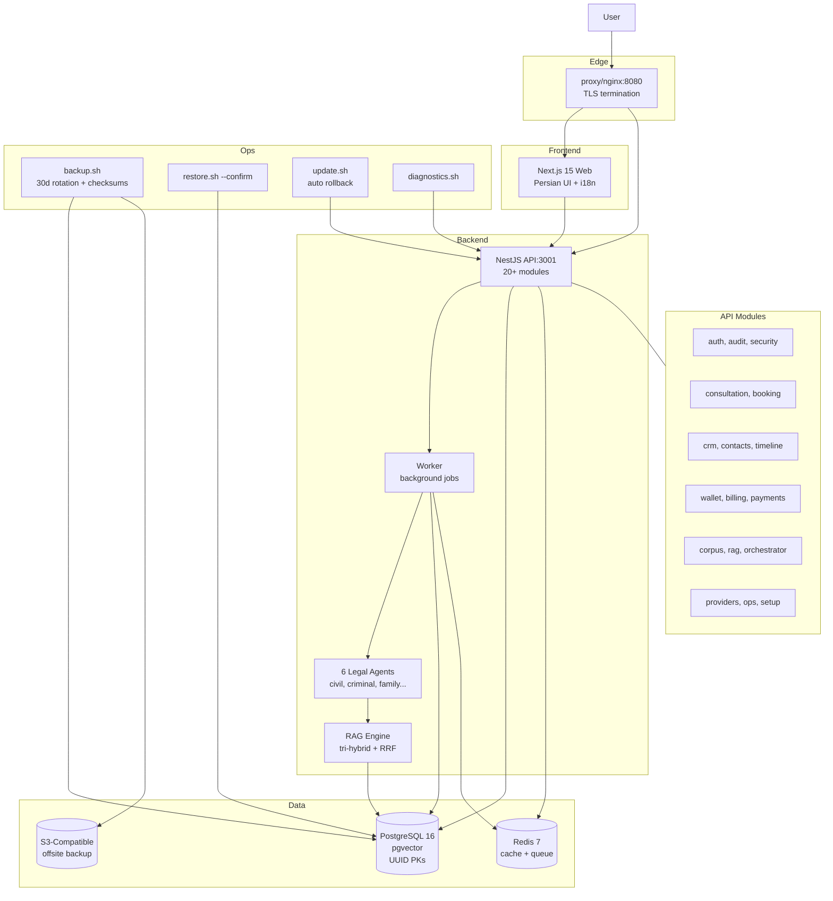

# Legal Platform — Self-Hosted Legal Practice OS for Iranian Lawyers

[](https://github.com/ansariaiadmin/legal-platform/actions/workflows/ci.yml)
[](https://github.com/ansariaiadmin/legal-platform/actions)
[](https://nodejs.org/)
[](https://nextjs.org/)
[](https://nestjs.com/)
[](https://www.postgresql.org/)
[](LICENSE)
[](apps/web/src/i18n/)

> Single-tenant, self-hosted legal practice platform: website CMS, booking, CRM with timeline, wallet & payments, notifications, AI workspace (RAG + drafts with 6 specialized agents), law update monitor, provider settings, diagnostics, backup/restore with S3 offsite, audit logs — all in Persian UI, English internals, one-command production deploy.

## 🚀 برای افراد غیر فنی / For Non-Technical Users — نصب در ۱ دقیقه!

**فقط یک دستور / Just one command:**

```bash
git clone https://github.com/ansariaiadmin/legal-platform.git
cd legal-platform
chmod +x install.sh
./install.sh
```

سپس مرورگر را باز کنید و تمام! / Then open browser and done!

- **راهنمای کامل فارسی:** [`INSTALL.md`](INSTALL.md) یا [`docs/USER_GUIDE_FA.md`](docs/USER_GUIDE_FA.md)
- **Full English Guide:** [`docs/USER_GUIDE_EN.md`](docs/USER_GUIDE_EN.md)
- **آپدیت:** `./update.sh` (بکاپ خودکار + آپدیت + سلامت چک)
- **وضعیت:** `./status.sh` | **لاگ:** `./logs.sh` | **توقف:** `./stop.sh`

**ویژگی‌های نسخه v1.0.4 (Strict Final 10/10 True):**
- ✅ نصب خودکار تمیز (clean install) — چک Docker، ساخت .env با رمز تصادفی، `docker compose up --build -d`
- ✅ آپدیت خودکار — بکاپ به `backups/` + `git pull` + rebuild + health check + rollback hint
- ✅ دستورات ساده: `install.sh`, `update.sh`, `start.sh`, `stop.sh`, `status.sh`, `logs.sh`, `backup.sh`
- ✅ ویندوز: `install.bat`, `update.bat`, etc.
- ✅ آموزش کامل تمام بخش‌ها در `docs/USER_GUIDE_FA.md` (فارسی)

> **برای افراد کاملا غیر فنی:** فقط `install.sh` را اجرا کنید، بعد آدرس را در مرورگر باز کنید — همین! (see `INSTALL.md`)

---


---

## What this proves (for freelance clients)

- **Production-grade self-hosted SaaS for regulated market:** One-command installer (`setup.sh`) validates host, installs Docker, generates all secrets, builds & starts stack, runs migrations, waits healthy. Includes backup (auto-rotated 30d, checksums, S3-compatible offsite, credentials excluded), restore (hard-confirmed + audit), update with auto-rollback, diagnostics, preflight-only mode. Zero-support design with Persian wizard, cron backup, troubleshooting in `docs/RUNBOOK.md`.
- **Persian NLP + multi-agent AI workspace:** RAG with tri-hybrid retrieval (lexical + structural + hashed vectors, RRF fuse), 6 specialized legal agents (civil, criminal, family, registration, international, base), draft requests/artifacts/review decisions, citation links, retrieval sessions. 29 Persian NLP tests (tokenization, NER, sentiment), 17 agent tests, 52 API tests — 98 total, secret-scan 0 findings, backup-prod.sh with encryption.
- **Modular monolith done right:** NestJS API + Next.js App Router + PostgreSQL 16 pgvector + Redis, typed application services, Redis queues, past-tense domain events, vertical scaling, failure domains (provider/AI/telephony outages never crash platform). Shared packages from `dist/` (build:packages must run before typecheck), test suites map to TS sources so stale build can never make test pass. CI: quality (typecheck + Nest graph bootstrap), migrations (real pgvector up→down→up determinism), integration (OTP lifecycle real PG+Redis), docker (images build + /api/health).

---

## Architecture



**Code sample — RAG tri-hybrid retrieval:**

```typescript
// apps/api/src/modules/rag/rag.service.ts
async query(query: string, budget: number) {
  const lexical = await this.lexical.search(query);      // FTS5
  const structural = await this.structural.search(query); // graph
  const vectors = await this.vectors.search(query);       // pgvector
  const fused = this.rrfFuse([lexical, structural, vectors]);
  return this.budgetAllocate(fused, budget); // token-budgeted
}

// 6 specialized agents share base
@Agent('civil-expert')
export class CivilExpert extends LegalExpertBase {
  async draft(request: DraftRequest): Promise<DraftArtifact> {
    const citations = await this.rag.query(request.issue);
    return this.generateWithCitations(citations);
  }
}
```

---

## Quickstart (tested)

```bash
# Production / field trial — one command
git clone https://github.com/ansariaiadmin/legal-platform.git
cd legal-platform
sudo ./setup.sh
# Validates host, installs Docker if needed, generates secrets,
# builds & starts stack, runs migrations, waits healthy
# -> http://localhost:8080

# Preflight only (no changes)
sudo ./setup.sh --check

# Development
cp .env.example .env
docker compose up --build
# -> http://localhost:8080 (proxy) -> web:3000, api:3001

# Step-by-step Persian guide
cat docs/RUNBOOK.md  # wizard, cron backup, troubleshooting

# Operations
./scripts/backup.sh          # auto-rotated, 30d retention, checksums
./scripts/restore.sh --confirm backups/backup-*.tar.gz
./scripts/update.sh          # update with auto rollback
./scripts/diagnostics.sh     # health & stale-backup checks

# Dev inner loop
npm ci
npm run build:packages       # domain, contracts, shared -> dist
npm run typecheck            # all workspaces
npm test                     # 98 tests (52 API + 29 Persian + 17 agents)
npm run build                # packages, then api + web

# Against real PG16 pgvector
npm run migrate:up -w @legal-platform/api
npm run test:e2e -w @legal-platform/api      # OTP lifecycle real DB
npm run test:migrations -w @legal-platform/api # up->down->up determinism
```

---

## Features Table

| Domain | Feature | Production Hardening |
|--------|---------|----------------------|
| **Website** | CMS (pages, posts, media, menus, SEO) | Nginx reverse proxy, TLS, Persian i18n |
| **Booking** | Consultation plans, availability, slots, reminders | Redis queue, failure domain isolated |
| **CRM** | Contacts, leads, timeline events, call logs | Partition-ready (audit_logs, usage_records) |
| **Finance** | Wallets, ledger (append-only), payments, refunds, AI credits | Encrypted provider secrets at rest |
| **AI Workspace** | RAG tri-hybrid, 6 agents, drafts, citations, review | Vector index, dimension migratable, 29 Persian tests |
| **Ops** | Backup/restore, diagnostics, audit, license, export/erase | Checksums, S3 offsite, credentials excluded, hard-confirm |
| **Security** | OTP, JWT, RBAC (lawyer_owner, staff, client, operator), audit | Secret-scan 0 findings, backup encryption |

**ASCII Demo — Production Deploy:**

```
$ sudo ./setup.sh
[1/7] Preflight: Ubuntu 22.04, 8GB RAM, 40GB disk... OK
[2/7] Docker: installed 24.0.5... OK
[3/7] Secrets: generated 12 secrets (API_SECRET, PG_PASS, REDIS_PASS...)... OK
[4/7] Build: docker compose build (api, web, worker, proxy)... OK (3m12s)
[5/7] Start: postgres (pgvector), redis, api, worker, web, proxy... OK
[6/7] Migrate: up -> 24 tables, uuid defaults... OK
[7/7] Health: /api/health 200, web 200, worker heartbeat... OK
=> https://legal.example.com ready (TLS via Let's Encrypt)
   Backup cron: 0 2 * * * /opt/legal-platform/scripts/backup.sh
```

---

## Services

| Service | Port | Description |
|---------|------|-------------|
| proxy (nginx) | 8080 | Reverse proxy, TLS |
| web (Next.js) | 3000 | Frontend Persian UI |
| api (NestJS) | 3001 | REST API |
| worker | - | Background jobs |
| postgres | 5432 | PG16 + pgvector |
| redis | 6379 | Cache + queue |

## Workspace Layout

```
apps/
  api/src/{main.ts, app.module.ts, config, database, modules/*, providers/*, jobs, security}
  web/src/{app, components, features/*, i18n, lib}
packages/{domain,contracts,shared}/src
infra/{docker,nginx,postgres,redis}
scripts/{install.sh,start.sh,stop.sh,backup.sh,restore.sh,update.sh,diagnostics.sh}
docs/{SPEC.md,RUNBOOK.md,GITHUB_SETUP.md}
docker-compose.yml / docker-compose.prod.yml
```

## CI

| Job | Catches |
|-----|---------|
| quality | Type errors, Nest graph bootstrap, unit tests |
| migrations | Schema drift — real pgvector up→down→up, tables + uuid defaults |
| integration | OTP login lifecycle real PG+Redis |
| docker | Images build + /api/health boot |

CodeQL + Dependabot in `.github/`. 98 tests total.

## License

AGPL-3.0 — see [LICENSE](LICENSE). Commercial product, open-source but protected. For commercial license without AGPL obligations, contact.