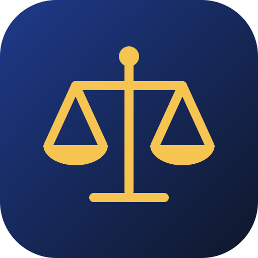

<div dir="rtl">

<p align="center">
  
</p>

<h1 align="center">پلتفرم حقوقی</h1>

<p align="center">
  نرم‌افزار متن‌باز و خودمیزبان برای دفاتر وکالت در ایران<br>
  دستیار حقوقی هوشمند · کتابخانهٔ قوانین با ارجاع دقیق · مشاورهٔ تلفنی نوبتی · پورتال موکلان
</p>

<p align="center">
  <a href="https://github.com/ansariaiadmin/legal-platform/actions/workflows/ci.yml"></a>
  
  <a href="LICENSE"></a>
  
</p>

<p align="center"><a href="README.en.md">English</a></p>

> **هشدار:** خروجی این نرم‌افزار مشاورهٔ حقوقی نیست. هر پاسخ و پیش‌نویس باید پیش از استفاده توسط وکیل دارای پروانه بررسی شود.

## معرفی

پلتفرم حقوقی روی سرور خود دفتر نصب می‌شود؛ اطلاعات پرونده‌ها و موکلان از سرور شما خارج نمی‌شود، مگر آن‌که خودتان یک سرویس ابری هوش مصنوعی را وصل کنید. محصول دو بخش دارد:

| بخش | نشانی | کاربر |
|---|---|---|
| داشبورد دفتر | `/` | وکیل و کارکنان دفتر |
| پورتال موکلان | `/portal/` | موکلان (قابل نصب روی گوشی به‌صورت PWA) |

## امکانات

**داشبورد دفتر**
- **دستیار حقوقی:** گفت‌وگو با دستیار اصلی که پرسش را به یکی از دستیاران تخصصی (مدنی، کیفری، خانواده، ثبتی، بین‌الملل و عمومی) می‌سپارد.
- **کتابخانهٔ حقوقی:** متن قوانین پس از تأیید وارد کتابخانه می‌شود و پاسخ‌ها فقط به منابع تأییدشده ارجاع می‌دهند. جست‌وجو ترکیبی است (متنی و برداری با pgvector).
- **پیش‌نویس‌ها:** تهیهٔ پیش‌نویس لایحه و قرارداد همراه با منابع، و گردش کار بررسی و تأیید توسط وکیل.
- **فایل‌ها:** بارگذاری و تحلیل اسناد دفتر (PDF، Word و متن).
- **مشاورهٔ تلفنی:** تعیین طرح‌های ۱۰، ۲۰ و ۳۰ دقیقه‌ای، باز و بسته کردن صف و فراخوانی موکل بعدی.
- **امضای دیجیتال:** امضای اسناد با RSA-2048 و راستی‌آزمایی آن.
- **امنیت:** رمز جداگانه برای بخش‌های حساس، ورود با passkey، گزارش ممیزی، بررسی امنیتی روزانه و نسخهٔ پشتیبان.
- **ویزارد راه‌اندازی:** پس از نخستین ورود، دفتر را گام‌به‌گام آماده می‌کند.

**پورتال موکلان**
- ورود با کد پیامکی، شارژ کیف پول از طریق درگاه پرداخت، خرید مشاوره و ورود به صف.
- نمایش جایگاه در صف و زمان تقریبی انتظار؛ پیامک هنگام نزدیک شدن نوبت.

## سرویس‌های قابل اتصال

| کاربرد | سرویس‌های پشتیبانی‌شده |
|---|---|
| هوش مصنوعی | هر سرویس سازگار با OpenAI API، ابری یا محلی (مانند Ollama) |
| پیامک | کاوه‌نگار، قاصدک |
| درگاه پرداخت | زرین‌پال |
| ایمیل | هر سرور SMTP |

تا وقتی سرویسی تنظیم نشده، قابلیت مربوط در محیط production غیرفعال می‌ماند و نتیجهٔ ساختگی نشان داده نمی‌شود. تماس تلفنی را خود وکیل برقرار می‌کند؛ اتصال خودکار به مرکز تلفن هنوز پیاده‌سازی نشده است.

## نصب سریع

پیش‌نیازها: Ubuntu 22.04 یا جدیدتر (یا WSL2 روی ویندوز)، ۴ گیگابایت RAM و ۴۰ گیگابایت فضای خالی.

```bash
git clone https://github.com/ansariaiadmin/legal-platform.git
cd legal-platform
sudo OWNER_PHONE=09120000000 ./setup.sh
```

اسکریپت در صورت نیاز Docker را نصب می‌کند، رمزها را به‌صورت تصادفی می‌سازد، سرویس‌ها را اجرا می‌کند و تا سالم شدن آن‌ها صبر می‌کند. پس از آن:

- داشبورد: `http://localhost:8080`
- پورتال موکلان: `http://localhost:8080/portal/`

با شمارهٔ `OWNER_PHONE` وارد شوید. تا وقتی پنل پیامک تنظیم نشده، کد ورود مالک در لاگ چاپ می‌شود:

```bash
docker compose logs api | grep OTP
```

راهنمای کامل، از جمله دامنه، HTTPS و اتصال پیامک و درگاه: [INSTALL.md](INSTALL.md)

## توسعه

```bash
npm ci
npm run build:packages
npm test          # آزمون‌های همهٔ بسته‌ها
npm run lint      # بررسی promiseهای بدون await در API
```

ساختار مخزن و قواعد مشارکت در [CONTRIBUTING.md](CONTRIBUTING.md) و [ARCHITECTURE.md](ARCHITECTURE.md) آمده است.

## مستندات

| سند | موضوع |
|---|---|
| [INSTALL.md](INSTALL.md) | نصب، دامنه، HTTPS و تنظیم سرویس‌ها |
| [docs/USER_GUIDE_FA.md](docs/USER_GUIDE_FA.md) | راهنمای کاربری فارسی |
| [docs/USER_GUIDE_EN.md](docs/USER_GUIDE_EN.md) | راهنمای کاربری انگلیسی |
| [docs/RUNBOOK.md](docs/RUNBOOK.md) | راهنمای عملیات و رفع اشکال |
| [docs/BACKUP.md](docs/BACKUP.md) | پشتیبان‌گیری و بازیابی |
| [docs/API.md](docs/API.md) | مرجع API |
| [ARCHITECTURE.md](ARCHITECTURE.md) | معماری |
| [SECURITY.md](SECURITY.md) | گزارش آسیب‌پذیری |
| [CHANGELOG.md](CHANGELOG.md) | تاریخچهٔ تغییرات |
| [ROADMAP.md](ROADMAP.md) | برنامهٔ آینده |

## حمایت از پروژه

این پروژه رایگان و متن‌باز است. اگر برایتان مفید بوده، هر مبلغی که مایل بودید حمایت کنید؛ صفحهٔ حمایت مالی به‌زودی در همین بخش و در بخش «درباره» برنامه قرار می‌گیرد. ستاره دادن به مخزن، گزارش اشکال و معرفی پروژه به همکاران هم کمک بزرگی است.

## سفارش و همکاری

برای راه‌اندازی و پشتیبانی، پروژه‌های اتوماسیون و ساخت پلتفرم اختصاصی:

- تلگرام: [@ansariaiadmin](https://t.me/ansariaiadmin)
- وب‌سایت: [ansariai.ir](https://ansariai.ir)

## مجوز و حق انتشار

حق انتشار © ۲۰۲۶ محمد انصاری. این نرم‌افزار تحت مجوز [GNU AGPL-3.0-or-later](LICENSE) همراه با شرایط تکمیلی بند ۷ منتشر شده است ([NOTICE](NOTICE)):

- عبارت «ساخته‌شده توسط محمد انصاری — ansariai.ir» باید در پانویس و صفحهٔ «درباره» همهٔ نسخه‌ها، از جمله نسخه‌های تغییریافته، باقی بماند.
- هیچ‌کس نمی‌تواند خود را پدیدآورندهٔ اصلی معرفی کند. نسخهٔ تغییریافته باید به‌روشنی تغییریافته اعلام شود و ذکر کند که بر پایهٔ «پلتفرم حقوقی اثر محمد انصاری» است.
- نام‌ها و نشان پروژه مشمول مجوز نیستند ([TRADEMARKS.md](TRADEMARKS.md)).
- هر کس نسخهٔ تغییریافته را به‌صورت سرویس تحت شبکه در اختیار کاربران بگذارد، باید کد منبع آن را هم در اختیارشان قرار دهد (بند ۱۳ AGPL).

</div>
